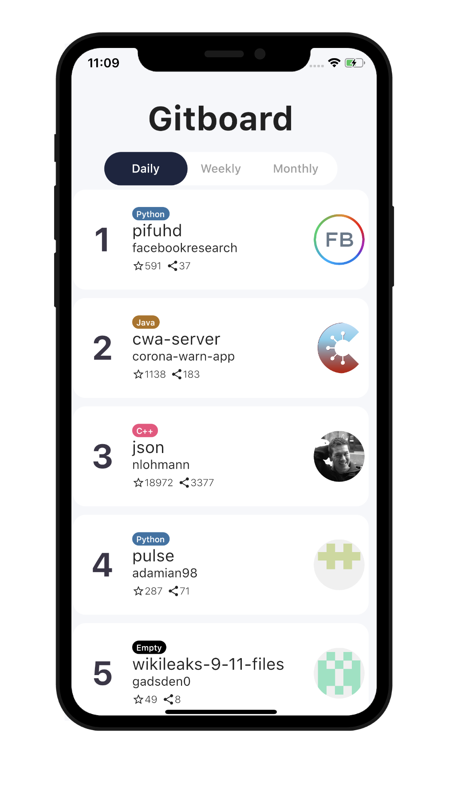

# Flutter Github Trending App
Flutter Github Trending App (Bloc, Provider)

### API
Github Trending API
* https://github.com/huchenme/github-trending-api

### Package
Dio : A powerful Http client for Dart
* https://pub.dev/packages/dio

Provider : A wrapper around InheritedWidget to make them easier to use and more reusable.
* https://pub.dev/packages/provider

Flutter ScreenUtil : A flutter plugin for adapting screen and font size.Let your UI display a reasonable layout on different screen sizes!
* https://pub.dev/packages/flutter_screenutil

Rxdart : RxDart adds additional capabilities to Dart Streams and StreamControllers.
* https://pub.dev/packages/rxdart

### Youtube

### Reference
Design
* https://bit.ly/2zA8nOy
